This report describes the FPGA and MCU Verifcation lab, lab 1. This lab took me about 32 hours to complete. Future versions of this lab should look at what is necessary for completing the lab (i.e. if multiple Git tutorials, which are actually helpful), so as to avoid overwhelming students with many extra tutorials that weren't necessarily helpful to the current lab. 

### Hardware Specifications
The development board is fully assembled. It is able to display all sixteen hexadecimal numbers. The image below shows the digit F. The dipswitches are arranged for the seven-segment so that when all the switches are closest to the FPGA, the output on the seven-segment display is zero. The rightmost digit is bit 0 and the leftmost digit is bit 1. 

 Click to view dipswitches and seven-segment display 

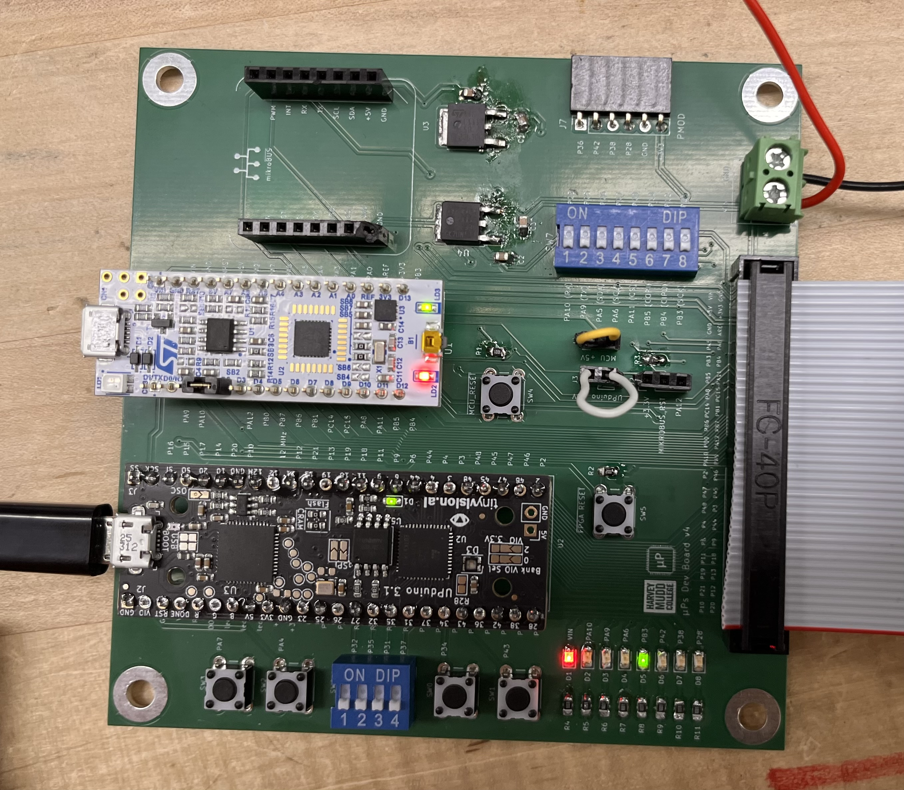
Dipswitches 

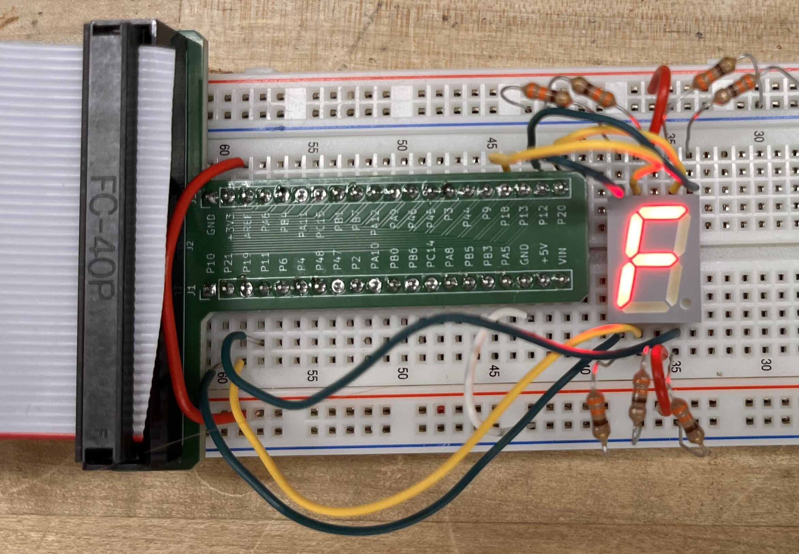
Seven-segment display

The LEDs have the specified logic operations. The picture below shows the case where both LED 0 and 1 are on, LED 2 is blinking. 

 Click to view LEDs 

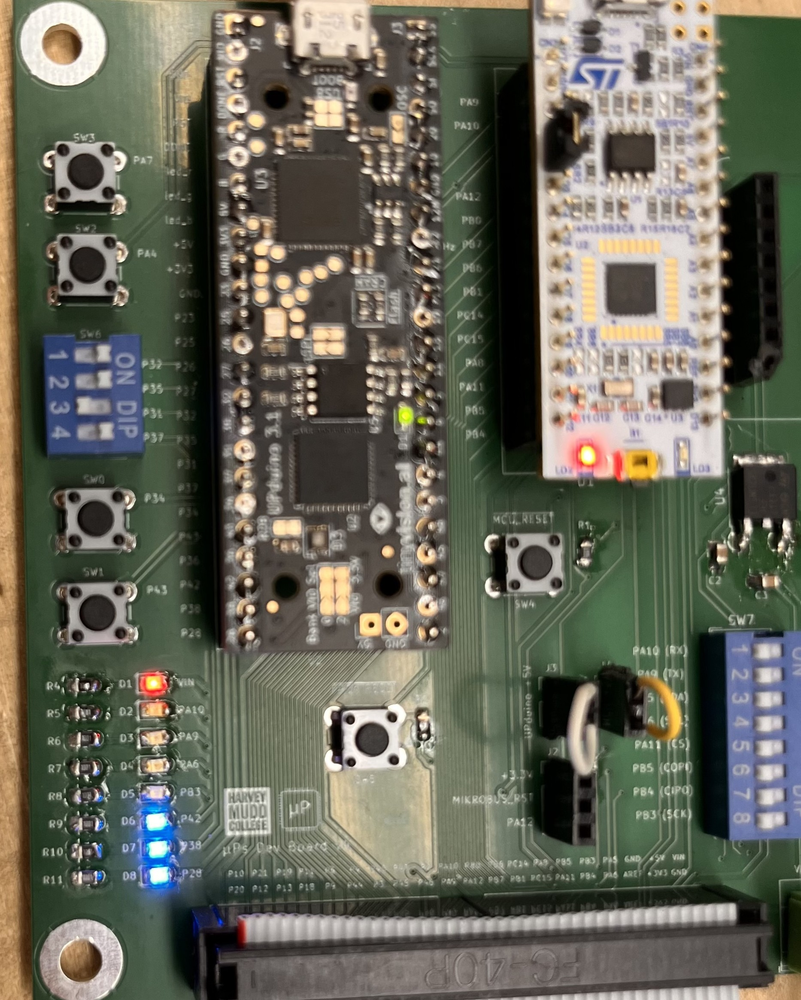

The FPGA is coded with Verilog code through the use of modules. 

 Click to view top level module 

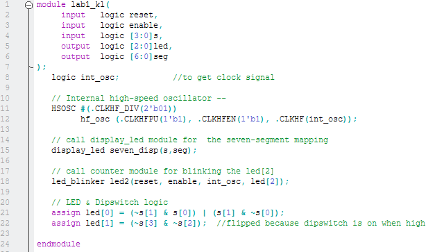

### Verilog Structure and Style
The FPGA was coded with three Verilog Modules. lab1_kl is the top-level module with assign statements for LED[1] and LED[0], led_blinker controls the blinking LED (LED[2]) through a counter, and display_led controls the seven-segment display connected to the board. 

 Click to view lab1_kl 

 Click to view led_blinker 

 Click to view display_led 

### Simulations and Waveforms 
Questa was used for simulations with testbenches for all modules. 

The first module is the main testbench. The waveform shows that the LEDs l and 2 are on when the correct s-signals are on. 

 Click to view LED[1] and LED[0] waveforms 

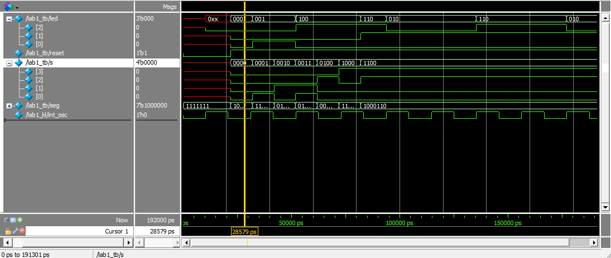

The second module is the blinker module. The four figures below show the reset and counter resetting functionality. 

 Click to view LED[2] waveforms 

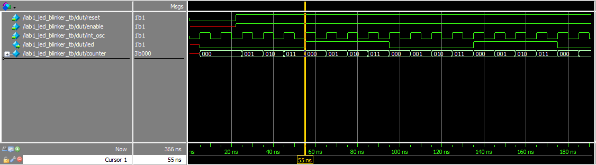
Reset = 1, enable = 1, LED is on

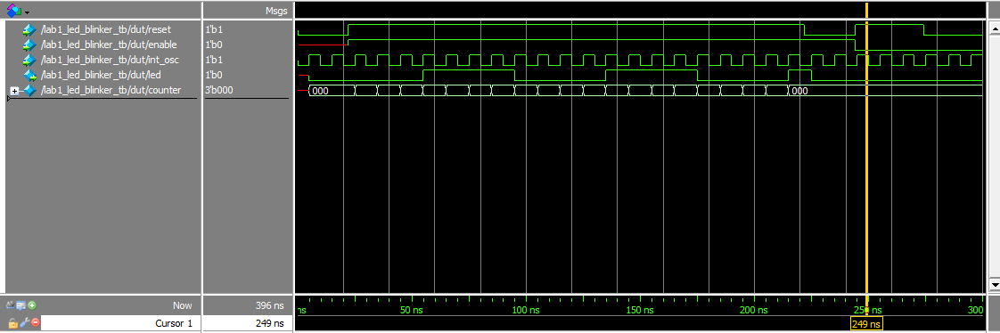
Reset = 1, enable = 0, LED is off

Reset = 0, enable = 1, LED is off

Reset = 0, enable = 0, LED is off

The third module is the seven segment-module, which matches the 15 states that the DIP switch (controlled by s) can be in. 

 Click to view seven-segment waveforms 

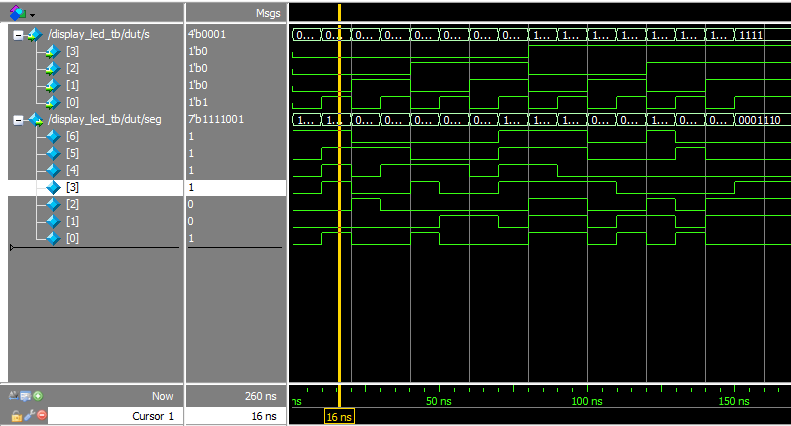

### Schematic and Block Diagram Specs
The first schematic shows how the seven-segment LED is powered and run from the Upduino. 

 Click to view LED Schematics -- LED[2:0] and seven-segment LEDs. 

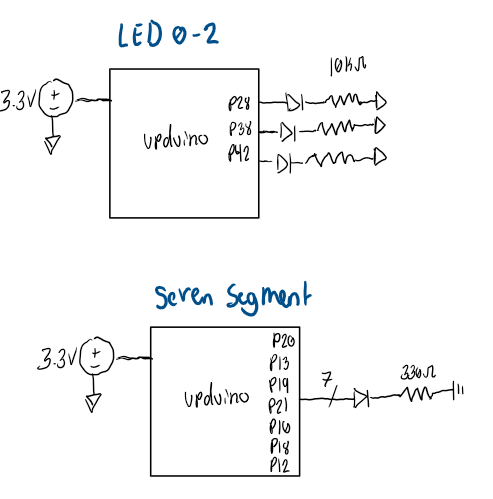

The second schematic shows the different digital modules created inside of verilog. 

 Click to view LED Schematics -- LED[2:0] and seven-segment LEDs. 

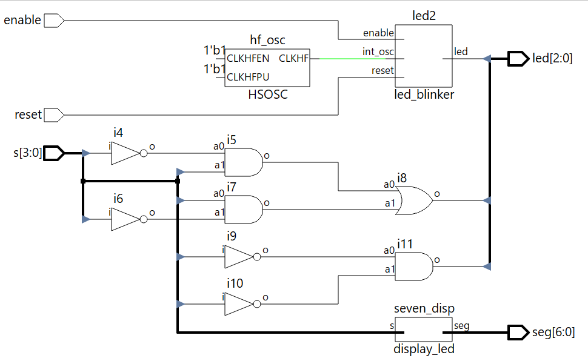

### Calculations
The seven-segment led requires pulldown resistors connected to ground, which need to be calculated based on the amount of voltage that the LED takes and the desired current through the pin and LEDs. 

 Click to view resistor calculations. 

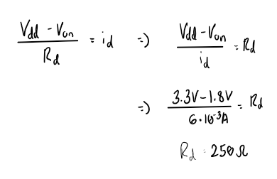

Additionally, in order to make a counter that took a 24MHz signal and take it down to a 2.4 Hz signal, calculations were neeed. 

 Click to view clock counter calculations 

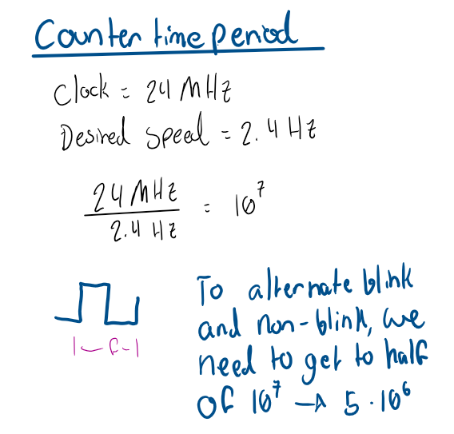

### AI Prototype
I used Gemini for my AI Prototype. After a input the initial code, there were three errors. First, one error was because there was no top-level specified module, which was my fault because this is something you need to set in Radiant rather than through the code. The second was that Gemini used an outdated version to reference the high-speed oscillator, which Radiant didn't recognize. Finally, in its configuration of the high-speed oscillator, the AI set the oscillator to 48 MHz when it said it was setting it to 12 MHz. Without having done this lab on my own, I might not have known that and I would've been confused as to why it didn't work. The AI did add some useful lines of code, however. Instead of parameterizing the module, it used local parameters to define the max count and the width. It also used the $clog2, which is a built-in function that calculates the minumum number of bits needed to make the argument of the function, which seems like it would be useful (see below).

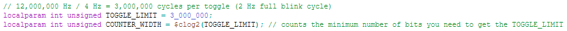

If I were to use an LLM in my workflow further, I would ask it questions about errors and feed it the code that was causing the errors, because the LLM was able to address the errors when confronted about them. 